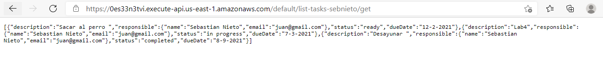
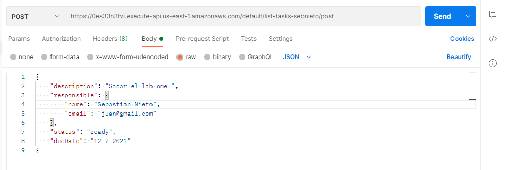
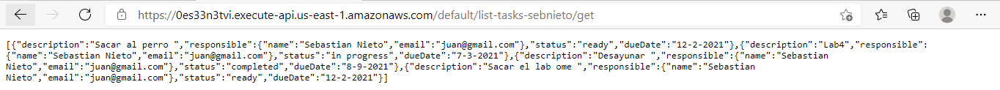

# 2.2-task-planner-api-part-2

# Prueba get

Este es el endpoint para probar el get: https://0es33n3tvi.execute-api.us-east-1.amazonaws.com/default/list-tasks-sebnieto/get


# Prueba post
Este es el endpoint para probar el post: https://0es33n3tvi.execute-api.us-east-1.amazonaws.com/default/list-tasks-sebnieto/post

Esta es una foto de como podria probarlo en postman, ademas anexo la estructura del json:

```
{
    "description": "Sacar el lab ome ",
    "responsible": {
        "name": "Sebastian Nieto",
        "email": "juan@gmail.com"
    },
    "status": "ready",
    "dueDate": "12-2-2021"
}

```



Prueba post:



